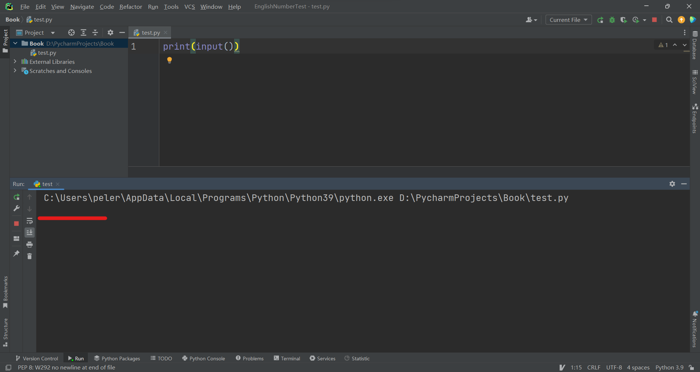
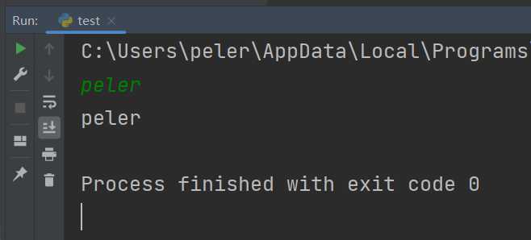

# 获得输入

## input函数

如果仔细分析一下我们日常使用软件的操作，你会发现根本上是我们通过某种方式给软件一个输入，获取它的输出，循环往复。比如你在浏览器中搜索问题，搜索的问题是输入，获得的答案是输出。在打游戏时，你的操作是输入，游戏中的人物随着你的操作移动或做出种种动作是输出。

我们现在已经学习了输出，那就让我们来学习如何获得输入吧。废话不多说，直接上代码：

```python
print(input())
```

运行后，在 Pycharm 的运行窗口中输入一些内容，回车:

<center>        <br>    <div style="color:orange; border-bottom: 1px solid #d9d9d9;    display: inline-block;    color: #999;    padding: 2px;">在红线标注处输入内容，回车</div> </center><br>

你会发现回车后我们输入的内容被输出了一遍：

<center>        <br>    <div style="color:orange; border-bottom: 1px solid #d9d9d9;    display: inline-block;    color: #999;    padding: 2px;">绿色的是我们的输入，白色是输出</div> </center><br>

还记得我们讲过的函数吗？没错，这里的 `input()` 也是一个函数。它会从 **终端** 读取我们输入的内容并以字符串形式将读取到的值返回。

这句话中有三点需要解释， `input()` 是一个名字叫做 `input` 的函数，在这里我们并没有将任何参数传递进去（没有将东西塞到黑盒里）。

终端是计算机系统中让用户输入数据和显示结果的地方，比如上图所示的 Pycharm 内置运行窗口就是一种终端。

我说过有的黑盒还会“产生”一些东西，这其实就是对函数返回值的一个形象的比喻。这里的 `input` 函数便是将从终端读取到的值返回了。`input` 函数的返回值变成了 `print` 函数的输入。调用了一个有返回值的函数之后，我们就可以将原来的函数看成是它的返回值。就像一道小学的混合运算题：

```
3+9+(5+2)
```

我们要计算这个式子的值，就要先把 `(5+2)` 的结果算出来，再将其当作一个整数带入：

```
 3+9+(5+2)
=3+9+7
=19
```

同理，我们来看一看 `print(input())` 语句是怎么执行的。`input` 函数的返回值变成了 `print` 函数的输入，那我要知道打印出来的内容，就要先知道 `input` 函数的返回值。假设我们输入了“peler”：

```python
  print(input())
->print("peler")
>>peler				# 这里表示“peler”被输出出来了
```

这一开始可能比较难理解，我建议你对照上面的混合运算多看几遍。

## 变量


## 数据类型

### 类型转换

### 万能函数